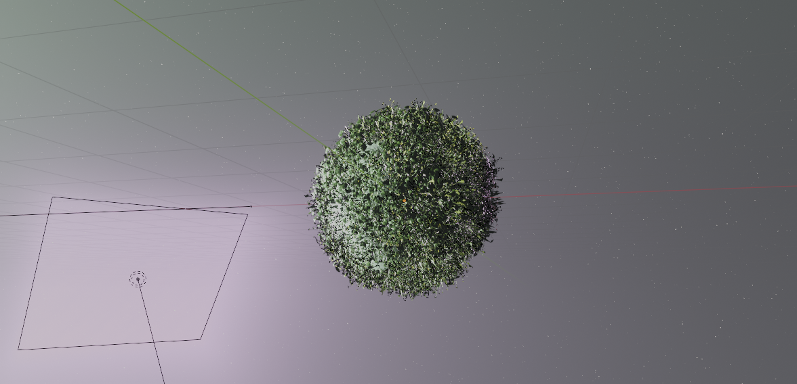
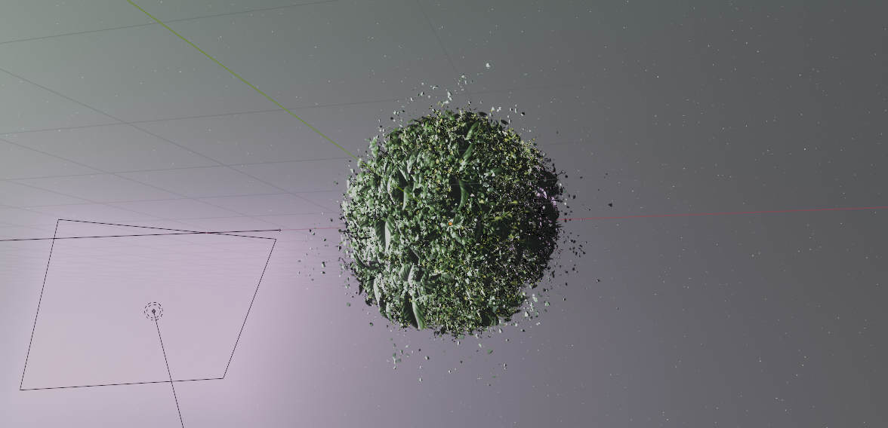
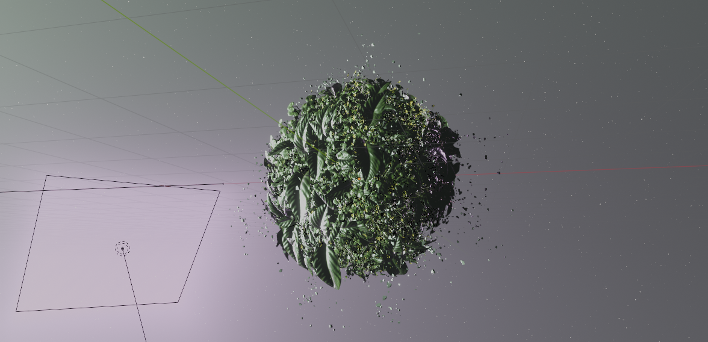
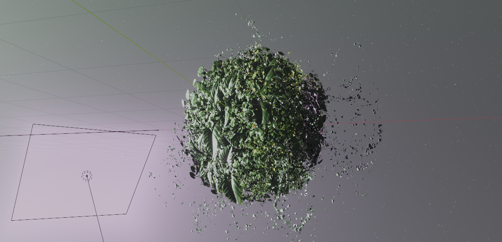
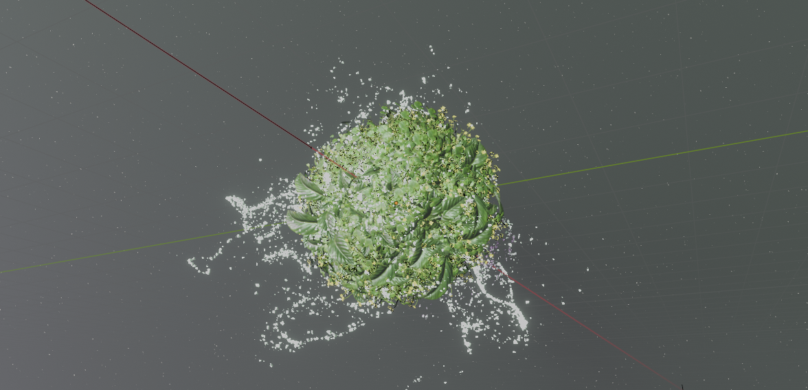

# Blender Procedural Particles Nature

WIP

Blender 4.0.2

## Art concepts:
* Small planet with growing plants (spring)
* Particles flying while plants growing

## Techncal Concepts:
* Using multiple hair particle systems
* Using Blender Python API to procedurally generate vertex weights (see script)
* Using generated vertex weights to control hair particle system density and scale
* Using emitter particle system with turbulence force field

## Gallery

## TODO:
* More hair particles systems for plants
* Enhance hair particle system growth
* enhance flying particles shape
* light and cam

## Ideas
* rendering as sprites for 2D game in unity
* vertex weights can not be key-framed and thus animated. Extend this concept in Houdini
