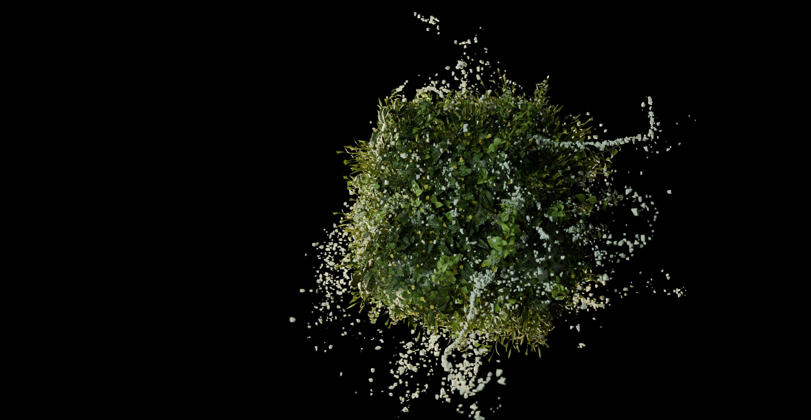

# Blender Procedural Particles Nature

WIP

Blender 4.0.2

## Art concepts:
* Small planet with growing plants (spring)
* Particles flying while plants growing
* Growth animation depends on plant size: smaller plants grow first
* All plants grow all the time, only those which started earlier grow slower later

## Techncal Concepts:
* Using multiple hair particle systems
* Using Blender Python API to procedurally generate vertex weights (see script)
* Using generated vertex weights to control hair particle system density and scale
* Using emitter particle system with turbulence force field
* Sphere (negative) displacement is guided by vertex weight: same vert weight as for hair particles can be used to obtain that terrain is adapted with instanced geometry.
* Animating polyhaven models: https://polyhaven.com/models

## Gallery

Artstation: https://www.artstation.com/artwork/rJkKPE

## TODO:
* composit stars
* water

## Ideas
* rendering as sprites for 2D game in unity
* vertex weights can not be key-framed and thus animated. Extend this concept in Houdini
